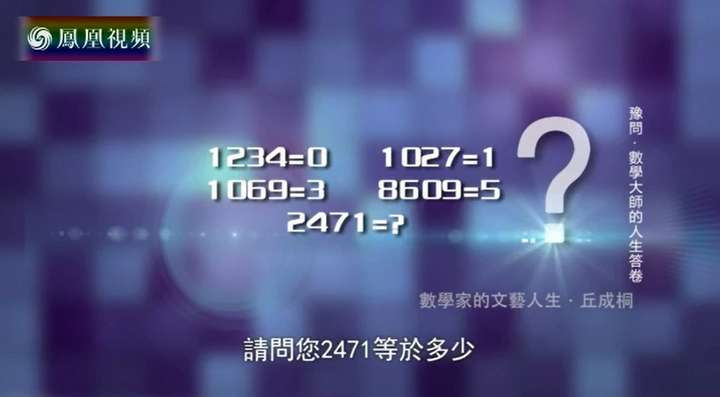

# Nano

大模型，小玩具。本仓库复刻自[karpathy/nanoGPT](https://github.com/karpathy/nanoGPT)，是Transformer语言模型的简单实现，供个人赏玩、研究、魔改和炼丹炉煲机之用。


Nano（東雲名乃）是动画《日常》中的角色，其角色设定是机器人。作品中另外一个角色“坂本”（Sakamoto），是一只会说话的黑猫，只不过必须戴上红色的围巾才会说话。

## 基本玩法：语言模型

首先安装依赖，建议在虚拟环境中安装。

```
conda create -n nano python=3.11 pysocks -y
conda activate nano
pip install -r requirements.txt
```

### 数据预处理

执行以下命令，注意修改代码中文本文件的路径。

```
python data.py
```

注：仓库中增加了来自[hhiim/Lacan](https://github.com/hhiim/Lacan)的精神分析黑话数据集，特此致谢。

### 训练

[B站视频](https://www.bilibili.com/video/BV1uv42127qP)

单机单卡或CPU训练（注意将`train_config.json`中的`device`选项设为`"cpu"`）：

```
python train.py
```

或者以分布式数据并行（DDP）方式启动训练（注意：`train_config.json`中的`gradient_accumulation_steps`应为显卡数的倍数）：

```
CUDA_VISIBLE_DEVICES=0,1,2,3 OMP_NUM_THREADS=1 python -m torch.distributed.run --nproc_per_node 4 train_ddp.py
```

或者基于DeepSpeed使用ZeRO零冗余优化器训练更大的模型。可以修改`ds_config.json`以优化训练效果。注意：根据[文档](https://www.deepspeed.ai/docs/config-json/)，`train_batch_size` must be equal to `train_micro_batch_size_per_gpu` * `gradient_accumulation` * number of GPUs。这里采用2节点4卡ZeRO3-Offload方式训练。

```
deepspeed train_deepspeed.py --deepspeed --deepspeed_config deepspeed_config.json --hostfile=hostfile.txt
```

其中`hostfile.txt`的内容如下：

```
192.168.10.52 slots=2
192.168.10.61 slots=2
```

所有场景通用的训练配置参数说明：

```
{
    // GPT Model Args
    "block_size": 128, // 如果是Q问题，则为 q_digits() + 1,
    "vocab_size": 10000,
    "n_layer": 2,
    "n_head": 4,
    "n_embd": 64,
    "dropout": 0.0, // for pretraining 0 is good, for finetuning try 0.1+
    "bias": false, // do we use bias inside LayerNorm and Linear layers?
    "is_causal": true, // 如果是排序问题，则为False

    // AdamW Optimizer Args
    "learning_rate": 6e-4, // max learning rate
    "max_iters": 100000, // total number of training iterations
    "weight_decay": 1e-1,
    "beta1": 0.9,
    "beta2": 0.99,

    // Learning Rate Scheduler
    "decay_lr": true, // whether to decay the learning rate
    "warmup_iters": 300, // how many steps to warm up for
    "lr_decay_iters": 100000, // should be ~= max_iters per Chinchilla
    "min_lr": 6e-5, // minimum learning rate, should be ~= learning_rate/10 per Chinchilla

    // Training Task
    "init_from": "pretrain", // "pretrain" or "finetune"
    "batch_size": 300,
    "random_seed": 114514,
    "eval_only_last_token_loss": false, // 如果是Q问题，则为True；如果是NLG问题，则为False
    "data_dir": "dataset",
    "ckpt_dir": "checkpoint",
    "eval_interval": 100,
    "log_interval": 10,
    "eval_iters": 5,

    // Misc
    "backend": "nccl", // "nccl", "gloo", etc.
    "device": "cuda:0", // "cpu", "cuda", "cuda:0", etc.
    "sdp_kernel": "math", // 选择`scaled_dot_product_attention`所使用的kernel "flash" || "mem_efficient" || "math"
    "dtype": "float16", // if torch.cuda.is_available() and torch.cuda.is_bf16_supported() else 'float16', # 'float32', 'bfloat16', or 'float16', the latter will auto implement a GradScaler
    "grad_clip": 1.0, // clip gradients at this value, or disable if == 0.0
    "gradient_accumulation_steps": 4
}
```

### 推理

如果是以DDP方式或者单机单卡或者CPU训练的模型，则执行以下命令。

```
python inference.py
```

如果是DeepSpeed训练的模型，则需要先执行`ckpt/ds`目录中的转换脚本，将其转化为PyTorch能够接受的state_dict格式，再执行推理脚本：

```
cd Nano/nlp/checkpoint/ds
python zero_to_fp32.py . ckpt_ds.pt
cd Nano/nlp
python inference_ds.py
```

## 其他玩法①：丘成桐先生也答不出的Q问题

所谓“Q问题”，是《鲁豫有约》20150902期节目中，主持人给丘成桐出的一道脑筋急转弯题。



```
python q.py
```

## 其他玩法②：排序，但是GPT

[B站视频](https://www.bilibili.com/video/BV1XZ421s7bM)

```
python sorting.py
```

## 研究笔记

### 训练性能

- 同等参数下，单卡P40训练性能可以达到6.5TFLOPS。训练参数：BlockSize=512,VocabSize=2114,L=2,H=4,E=512,BatchSize=100

### 算子`scaled_dot_product_attention`的性能

PyTorch 2.0 以上支持基于 [FlashAttention](https://arxiv.org/abs/2205.14135) 的注意力算子计算加速。目前有3种kernel，但是不支持较旧的GPU。分别启用3种kernel，实测相对性能如下：

|Kernel|flash_sdp|mem_efficient_sdp|math_sdp|
|------|------|----|--|
|相对时间|(不支持)|2.75|1(基准)|
|相对显存|(不支持)|0.78|1(基准)|

## 参考文献

- A Vaswani, N Shazeer, N Parmar, et al. [Attention Is All You Need](https://arxiv.org/abs/1706.03762) [J]. Advances in Neural Information Processing Systems, 2017, 30.
- A Radford, K Narasimhan, T Salimans, et al. [Improving Language Understanding by Generative Pre-Training](https://s3-us-west-2.amazonaws.com/openai-assets/research-covers/language-unsupervised/language_understanding_paper.pdf) [J]. 2018.
- [GPT可视化](https://bbycroft.net/llm)
- [论文分享：新型注意力算法FlashAttention](https://www.bilibili.com/video/BV1zs4y1J7tb/)
- https://huggingface.co/docs/text-generation-inference/conceptual/flash_attention
