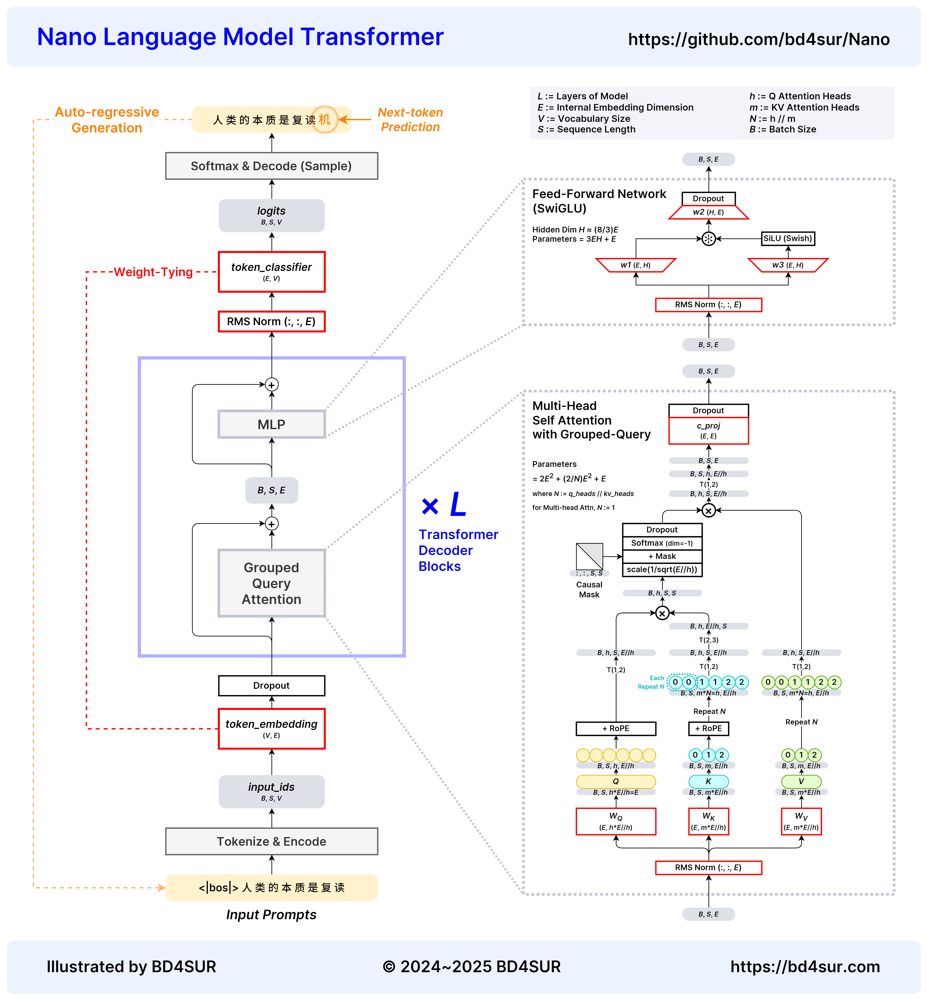
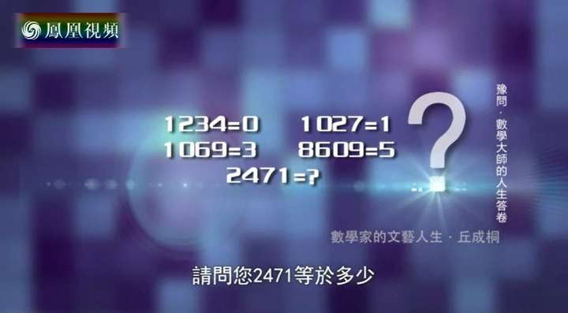

# Nano - Large Model, Tiny Toy

✨[体验推理效果](https://bd4sur.com/Nano/infer) / 📺[B站视频：手机浏览器推理+ASR+TTS](https://www.bilibili.com/video/BV1NAieYiEFi) / 📺[B站视频：HomeLab炼丹](https://www.bilibili.com/video/BV1uv42127qP)

**正在训练168M问答模型，预计2025年1月10日前后训练完成，并固化技术状态**


**Nano**是Transformer结构的自回归语言模型，供个人赏玩、研究、魔改和炼丹炉煲机之用。期望：

- 基于PyTorch，实现一个具体而微的Transformer语言模型，不依赖🤗。
- 实现模型的预训练、监督微调过程。不实现人类反馈强化学习。
- 从头训练出56M、168M参数的语言模型，以及配套的LoRA插件。
- 实现各类计算设备上的推理，同时支持可插拔的LoRA插件。
- 研究模型的动力学、训/推加速、模型和算法的优化提效等科学和工程问题。
- 探索Transformer模型在自然语言处理以外的各类问题上的潜能。
- 建立起关于语言模型的合理预期和感性经验，对大语言模型祛魅。

为什么叫“Nano”：

- 東雲なの（Shinonome **Nano**）和坂本是动画《日常》的角色。なの是博士创造的女高中生机器人，而坂本是一只会说话的黑猫。
- 本仓库主要复刻自Karpathy大佬的[nanoGPT](https://github.com/karpathy/nanoGPT)。取名Nano也是为了致(chao)敬(xi)nanoGPT。


## 模型和数据

预训练模型和问答模型（其中bin扩展名的模型可用于浏览器推理）：

|规模|LoRA插件|
|-----|-----------|
|[Nano-56M](https://huggingface.co/bd4sur/Nano-56M)|（正在训练）|
|[Nano-168M](https://huggingface.co/bd4sur/Nano-168M)（中间产物，正在训练）|（正在训练）|

数据集：

- 预训练数据：[Nano-PT-10G](https://huggingface.co/datasets/bd4sur/Nano-PT-10G)
- 监督微调数据：正在整理。

数据集为7z压缩包，解压口令“nano”。

## 使用说明

### 0. 百闻不如一见：立刻体验推理效果

**WASM/JS实现的基于浏览器的CPU推理**

- 访问[在线体验页面](https://bd4sur.com/Nano/infer)，或者用浏览器直接打开`Nano/infer/index.html`。
- 按页面提示，下载基座模型、指令微调模型或LoRA插件（扩展名均为bin）。
- 点击页面下方按钮，打开基座模型或指令微调模型。
- 可切换文本续写模式和指令问答模式，默认后者。推荐使用指令微调后模型，在指令问答模式下体验。
- 可随时加载或卸载LoRA插件。注意LoRA插件需要与某个预训练基座模型匹配。
- 使用`export.py`将检查点文件转换为基座模型或者LoRA插件，详见下文。
- 所有推理过程（含ASR和TTS）均在本地浏览器内部进行。

**C语言实现的CPU推理**

- 首先下载基座模型、指令微调模型或LoRA插件（扩展名均为bin）。
- 将`Nano/infer_c/infer.c`中模型文件的路径修改为实际的绝对路径。
- 在`Nano/infer_c`中执行`make`，编译得到可执行文件。默认启用OpenMP并行优化。
- 执行`OMP_NUM_THREADS=<CPU线程数/2> ./infer <模型文件路径.bin> -i "提示语"`，开始推理。
- 正在研究模型量化。

**基于CUDA/cuBLAS实现的GPU推理**

- 正在研究

**基于 WebGPU / ONNX Runtime Web 实现的GPU推理**

- 正在研究（参考[WebLLM](https://webllm.mlc.ai/)）

**基于PyTorch的CPU/GPU推理**

首先下载pt扩展名的基座模型、指令微调模型或LoRA插件到`checkpoint`目录。

执行`python infer.py -i -m checkpoint/xxx.pt [-l lora.pt]`，其中`xxx.pt`是模型检查点文件，`lora.pt`是LoRA模块的检查点文件。可选的命令行参数如下：

- `-m` or `--model`：字符串，模型相对路径。
- `-l` or `--lora`：字符串，LoRA模块的相对路径。
- `-i` or `--instruct`：开关标识。若启用，则对输入套用指令模板，以支持指令微调模型上的指令问答；若不启用，则为自回归式文本生成。
- `-s` or `--max_seq_length`：整数，序列最大长度，默认为模型的上下文窗口长度。
- `-t` or `--temperature`：浮点数，生成温度参数，默认值为1.0，越高则生成越随机。
- `-k` or `--top_k`：整数，前k采样，默认值为5，越高则生成越多样。
- `-r` or `--repetition_penalty`：浮点数，复读惩罚，默认值为1.2，越大则越抑制生成重复的词元。
- `-p` or `--profile`：开关标识。若启用，则统计性能数据，包括首词元延迟、词元生成速率等。

### 1. 安装依赖

一般要求：

- 硬件：建议使用英伟达GPU，以计算能力7.0以上的为宜，详见[英伟达官网](https://developer.nvidia.com/cuda-gpus)。若只有CPU也无妨。
- 软件：建议使用Ubuntu等Linux操作系统，并安装Anaconda/Miniconda等环境管理工具。

如果想基于PyTorch进行模型的训练、推理、数据清洗和开发等工作：

```
conda create -n nano python=3.11 pysocks -y
conda activate nano
python -m pip install -r requirements.txt
```

如果想基于Emscripten进行浏览器推理引擎的开发：参照[文档](https://emscripten.org/docs/getting_started/downloads.html)安装Emscripten工具链。

### 2. 数据下载·预处理

- 自行准备或者下载笔者收集的预训练数据集和指令微调数据集。
- 解压得到`pretrain.txt`和`sft.jsonl`两个文件，移动到`dataset`目录下。
- 将`data.py`中`PRETRAIN_DATASETS`和`SFT_DATASET`替换为刚刚下载的两个文件。
- 执行`python data.py`，进行数据预处理。可能占用大量记忆体和存储空间，请提前预留。

### 3. 预训练和监督微调

大模型的训练非常昂贵，需要PFLOP甚至EFLOP量级的计算量。请勿低估让电脑说人话的成本。因此，开始训练之前，请先确认几件事：

- 请做好训练过程随时会宕掉的心理准备，合理设置检查点保存策略。
- 若长时间训练，**强烈建议使用 [GNU Screen](https://www.gnu.org/software/screen/) 等终端切换工具，保证训练进程不被意外杀掉**。
- 若使用多机分布式训练，请先提前配置好分布式环境，例如无密码ssh认证等。

> 简单估算训练时间：对58M参数的GPT语言模型(L=16, H=16, E=512, VocabSize=512)作预训练，按照[文献](https://arxiv.org/abs/2204.02311)中提供的算法进行计算，每个词元所需计算量约为403MFlop。如果使用10亿词元的语料进行一轮(epoch)预训练，则总计算量约为403PFlop。实际使用单卡A100进行训练，**实测耗时约5200秒（1.44小时）**，对应运算速度为78TFlop/s，是A100标称BF16算力312TFlop/s的25%，也即MFU为25%左右。

**预训练**：

在预训练之前，首先根据规模扩展法则确定模型的规模、性能和算力预算，再确定模型的结构参数。作为参考，笔者训练的56M模型的参数如下（在`config/model_config.json`中设置）：

|block_size|vocab_size|n_layer|n_embd|n_head|n_kv_head|n_hidden|norm_eps|
|----|----|----|----|----|----|----|----|
|512|16384|16|512|16|8|1408|1e-5|

默认使用RoPE，预训练阶段Dropout为0。后文讲解这些参数的具体含义。一般而言，对于小规模模型，模型的长宽比例应适当，在保证宽度（n_embd）的前提下，尽量加大深度（n_layer）。

单卡或者CPU训练，执行

```bash
python train.py -m config/model_config.json -t config/config_pretrain.json
```

分布式数据并行（DDP）训练，在主节点上执行以下命令。注意设置卡数。

```bash
CUDA_VISIBLE_DEVICES=0,1,2,3 \
OMP_NUM_THREADS=1 \
python -m torch.distributed.run --nproc_per_node 4 \
train.py -m config/model_config.json -t config/config_pretrain.json
```

如果从某个检查点开始继续预训练，需要带上参数`-c`。

请注意：

- 训练参数的设置与训练任务和算力资源相关。将`config/config_pretrain.json`中的`batch_size`设置为一个能够充分利用显存的值。对于 AGX Orin (64GiB)，训练56M模型，可设置为160。
- 训练没有最大步数限制。因此，需要自行决定何时中止训练。建议不少于1轮（epoch），保证模型“见过”全部语料。
- 如果使用DDP训练，`gradient_accumulation_steps`应设置为显卡数的整数倍。
- 支持保存模型检查点。训练过程中，程序将按照模型保存策略，保存模型训练检查点到`checkpoint`目录。保存策略主要有三点：一是根据训练配置文件中规定的间隔，每隔一定的步数保存一个检查点；二是只有当验证集损失下降才会保存检查点；三是每隔1000步定期保存一次检查点。优先级：策略3 > 策略2 > 策略1。
- 支持手动断点续训。如果预训练意外中止，可以将`config/config_pretrain.json`中的`from_checkpoint`字段设为上一个检查点的相对路径`"checkpoint/xxx.pt"`，然后重新启动训练。
- 支持训练过程监控。每次训练，程序都会记录一个新的训练日志文件`train_xxx.log`，位于仓库根目录。执行`python plot_loss.py -n train_xxx.log`，绘制训练集损失曲线。

**监督微调（全参数）**

监督微调一般是在某个预训练模型的基础上作继续训练，因而首先将`config/config_sft.json`中的`from_checkpoint`字段设为预训练模型的相对路径`"checkpoint/xxx.pt"`。然后执行下列命令：

```bash
# 单卡或CPU
python train.py -m config/model_config.json -t config/config_sft.json

# DDP
CUDA_VISIBLE_DEVICES=0,1,2,3 \
OMP_NUM_THREADS=1 \
python -m torch.distributed.run --nproc_per_node 4 \
train.py -m config/model_config.json -t config/config_sft.json
```

请注意：

- 业界一般认为SFT并不能为模型注入新知识，SFT只是在海量的预训练先验知识中，建立起Q和A之间的关联，同时通过预训练阶段没有见过的特殊词元，引导模型建立指令跟随能力。
- SFT阶段一般启用Dropout，一般设置为0.1。
- 监督微调的训练轮数，应当根据实际情况灵活选择。一般来说，如果训练轮数过少，模型可能难以学习到指令跟随能力。而训练轮数过多，则可能遗忘预训练过程中获得的语言能力，以及在监督微调数据集上过拟合。

**监督微调（LoRA）**

[低秩适配（Low-rank adapter）技术]()是一种参数高效微调（PEFT）技术，旨在降低大模型微调的计算量。LoRA模型可以视为基座模型的“外挂”，训练过程中，基座模型被冻结，仅优化外挂LoRA模块的参数；而在推理过程中，LoRA模块可以灵活地从基座模型上挂载或卸载，不干扰基座模型本身。Nano支持LoRA模型的训练、Torch推理和端侧推理。

LoRA微调在任务性质、优化目标上与全参数微调没有区别，但是在训练产物和训练过程的动力学性质上与全参数微调有比较大的差异，例如：

- LoRA的训练产物是LoRA模块，其规模一般仅有基座模型的10%以内，尺寸很小。
- LoRA模块并不能独立使用，必须挂载到训练时所依附的基座模型上才能发挥作用。
- LoRA训练的计算量并不小，因为训练过程中还是需要完整进行基座模型的前向传播，并且LoRA模型训练收敛较慢甚至不收敛，且对超参设置非常敏感，需要多次实验才能找到合适的超参。
- LoRA微调，或者说一切监督微调，都不是解决领域能力注入的银弹。LoRA更适合作语言风格微调这类与考试和事实性信息注入关系不大的任务，例如模仿某人的说话风格等等。

与全参数微调类似，先将`config/config_lora.json`中的`from_checkpoint`字段设为预训练模型的相对路径`"checkpoint/xxx.pt"`。然后执行下列命令：

```bash
python train.py -m config/model_config.json -t config/config_lora.json
```

### 4. 模型转换

模型转换的目的，是将Torch训练出的模型检查点（扩展名为pt）转换为端侧推理所需的模型文件（扩展名为bin），以及对模型进行量化、压缩，以缩减模型尺寸，便于分发、部署、推理加速。

```bash
python export.py model.bin [--checkpoint | --quant | --lora] checkpoint.pt
```

模型文件的格式参考了[karpathy/llama2.c](https://github.com/karpathy/llama2.c)，但是有不同之处。描述如下：

```
model_file
  ├─header             (u32*64=256B定长)
  │   ├─magic_number_0 (u32=4B) = 0x42443453
  │   ├─magic_number_1 (u32=4B) = 0x55524c4d
  │   ├─major_version  (u32=4B)
  │   ├─minor_version  (u32=4B)
  │   ├─model_type     (u32=4B)
  │   ├─config_length  (u32=4B)
  │   ├─model_config   (u32*config_length)
  │   ├─quant_config   (u32*x) 量化相关参数，详见`export.py`中的实现
  │   ╰─padding        (u8填充到256B)
  ├─tokenizer_config   (不定长) 其详细定义见`export.py`中的注释，LoRA模块无此字段
  ╰─model_params       (不定长) 其详细定义见`export.py`中的实现
```

## 技术要点简述

**Transformer模型结构**

Nano基本上沿用了Llama的模型结构设计，如下图所示。



- 模型结构以Llama2和GPT（[karpathy/nanoGPT](https://github.com/karpathy/nanoGPT)）为主要参考。
- 使用RoPE位置编码（可选用训练位置编码）和前置RMSNorm。
- 使用分组查询注意力（GQA）。
- 使用SwiGLU，参考[文献](https://arxiv.org/pdf/2002.05202)。
- 可选择因果自注意力或完全的自注意力，前者用于语言模型，后者用于在其他任务上的探索。
- 词元嵌入层与分类层共享权重。关于这个问题，可参考[文献](https://spaces.ac.cn/archives/9698)。
- 支持KV-Cache。
- 支持插件化的低秩适配（LoRA）训练和推理。

模型结构参数`model_config.json`：

|参数|类型|默认值|说明|
|-|-|-|-|
|block_size|int|256|上下文（窗口）长度|
|vocab_size|int|10000|词典长度（实际取决于词元编码器）|
|n_layer|int|4|模型深度，即Transformer模型层数|
|n_head|int|4|Q注意力头数|
|n_kv_head|int|4|KV注意力头数|
|n_embd|int|256|模型宽度：内部表示向量的维度|
|dropout|float|0.0|随机丢弃层的丢弃概率|
|bias|bool|False|线性变换层加偏置？|
|use_rope|bool|True|使用RoPE位置编码？反之使用训练位置编码|
|norm_eps|float|1e-5|均方根标准化层参数|
|is_causal|bool|True|因果注意力？|

**数据预处理**

- 包含文本分块、词元编码、数据集划分、随机打乱、SFT模板组装等处理步骤。
- 为了在有限的记忆体内打乱巨大的数据集，将巨大数据集文件划分为一定大小的块，暂存在磁盘上，在块内进行随机打乱，然后将打乱后的各块按照乱序重新拼接起来。这样做的好处是能够在记忆体有限的机器上处理TB级数据集，坏处是无法在整个数据集的范围内彻底随机打乱，实际训练过程中可以看到loss的周期性尖峰，可能与此有关。这是一种权衡。
- 考虑到大规模预训练过程中验证集损失的意义并不是决定性的，同时为了充分利用宝贵的数据资源，在默认实现中，数据集划分实际上并未严格隔离训练集和验证集，训练集等于100%的数据集，验证集是从训练集中简单抽取5%得到。

**词元编码**

- Nano使用简单的启发式词元编码，也就是给某个字符集中的独立字符、以及某个人工指定的词表中的每个词条，赋予唯一整数编号，作为词元编号。词元编码的输入是unicode码点序列（而非BPE的字节序列），输出是词元编码的序列。
- 为了提升英文编码效率，在词表中手工添加了部分英文单词。
- 词元编码器采用Trie树+最大前向匹配算法进行分词。
- 仓库中同时包含了tiktoken提供的一个BPE词元编码算法，由于速度很慢，并不实用，因此仅作为参照，并不实际使用。之所以不使用BPE等词元编码工具，例如tiktoken、Tokenizers等，一方面是为了最小化外部依赖，另一方面也是想探索不含（高效）词元编码的语言模型效果如何。

**预训练数据格式**

- 原则上讲，随便什么文本都可以，没有任何的格式要求。
- 建议在独立文章的前后加上定界用的特殊词元`<|bos|>`和`<|eos|>`。这有助于避免训练时将不相关的文本混淆到同一个上下文窗口中（目前暂未实现）。
- 但是要注意“垃圾进、垃圾出”喔！因此，如果想获得比较好的模型，就务必重视预训练数据的处理工作。

**监督微调（指令微调）数据格式**

- Nano指令模板格式：`<|InstructMark|>提示语<|ResponseMark|>答复<|eos|><|Padding|>*`，填充至上下文长度。
- SFT数据集是JSONL格式，每一行是一轮QA，格式为`{"question": "提示语", "answer": "答复"}`，在数据预处理阶段转换为指令模板的格式。
- Nano现在不支持多轮对话，因多轮对话在原理上与单轮对话的SFT没有本质区别。后续可能会支持。

**模型训练参数**

- `from_checkpoint: str`：从哪个检查点继续训练。其值是绝对路径。说明：**训练选项中涉及的所有路径，都是绝对路径**。
- `save_checkpoint_to: str`：检查点保存位置的绝对路径。其值必须是目录。默认值为仓库根目录下`checkpoint/`目录。
- `dataset_path: [[str, str], ...]`：预处理后的数据集的绝对路径。该字段的值为列表，列表的每一项都是含有两个元素的子列表，子列表的第一个元素是训练集的绝对路径，第二个元素是验证集的绝对路径。
- `tokenizer_path: str`：词表绝对路径。默认值为仓库根目录下`tokenizer/tokenizer_16384.json`。
- `random_seed: int`：Torch的随机数种子。默认值为39。固定这个值，便于复现特定结果，利于调试。
- `batch_size: int`：训练批大小。默认值为32。一般来说，批大小越大，越有利于模型收敛，也更能充分利用算力资源。但代价是成倍消耗显存。如果启用梯度累加，则实际等效批大小为`batch_size`乘以`gradient_accumulation_steps`。
- `gradient_accumulation_steps: int`：梯度累加步数。默认值：1。在DDP场景下，梯度累积步数必须是GPU卡数的整数倍。梯度累加技术可以在有限的批次大小上模拟以较大批大小训练的效果，其原理是以时间换空间，根据偏导数的加法分配律，将几个小批次上多步迭代得到的梯度进行累加，使用累加后的梯度一次性更新参数，达到模拟较大批次的效果。
- `grad_clip: float`：梯度压限系数，用于防止梯度爆炸。默认值：1.0。
- `dropout: float`：随机丢弃层的丢弃概率，仅在训练阶段有效。默认值：0。预训练阶段一般设置为0，微调阶段一般为非0。
- `learning_rate: float`：初始学习率。默认值：6e-4。
- `weight_decay: float`：权重衰减系数。默认值：1e-1。
- `beta1: float`：AdamW优化器参数，详见[文档](https://pytorch.org/docs/stable/generated/torch.optim.AdamW.html)。默认值：0.9。
- `beta2: float`：AdamW优化器参数，详见[文档](https://pytorch.org/docs/stable/generated/torch.optim.AdamW.html)。默认值：0.99。
- `decay_lr: bool`：是否启用学习率调度？若不启用，则为恒定学习率。默认值：true。
- `warmup_iters: int`：学习率预热阶段的步数，仅当启用学习率调度时有效。默认值：10000。
- `lr_decay_iters: int`：学习率调度的总步数，仅当启用学习率调度时有效。默认值：1e9。
- `min_lr: float`：最小学习率，仅当启用学习率调度时有效。默认值：6e-5。
- `eval_interval: int`：每隔几步在验证集上计算一次损失。默认值：100。说明：如果满足检查点保存条件，将保存检查点。
- `log_interval: int`：每隔几步打印一次日志。默认值：10。注意：打印日志会计算损失值，比较耗时，因此不建议过于频繁地打印日志。
- `eval_iters: int`：每次验证需要用几批数据。默认值：5。
- `backend: str`：分布式通信后端。可选值：`nccl`等。用于DDP。
- `device: str`：计算设备。可选值：`cuda`、`cuda:x`用于指定某个GPU、`cpu`、`mps`等。一般无需特别设置，除非：①设备无显卡，将自动回落到CPU；②DDP模式下将自动设置为某一块GPU。
- `sdp_kernel: str`：缩放点积注意力的实现。可选值：`math`基础、`flash`高效（默认）、`mem_efficient`节省显存。其中`flash`仅支持FP16和BF16两种输入精度，且可能存在其他限制条件。
- `dtype: str`：训练数据类型。可选值：`float32`单精度（E8M23）、`float16`半精度（E5M10）、`bfloat16`半精度（E8M7，默认）。一般而言，若使用Ampere及以上的GPU架构，建议使用BF16。
- `use_amp: bool`：是否使用自动混合精度技术？仅当`dtype`设置为FP16和BF16时，才支持AMP。一般而言，启用AMP可节约显存占用，同时有助于训练稳定和收敛，也能够充分利用半精度运算所带来的速度增益。但是笔者实测发现，在 AGX Orin 和 Orin NX 等Ampere架构的GPU上，关闭AMP并使用BF16数据类型，性能更高，但代价是损失数值计算精度，可能带来模型难以收敛的风险。若AMP开启，默认同时启用TF32支持，以提升32位浮点数的运算性能。

**解码策略**

- Nano采用基于温度的随机采样策略，结合top-p、top-k采样和重复惩罚机制，从语言模型输出的概率分布中按照概率随机地采样出词元序列。若温度为0，则退化为贪心采样，即每次都选概率最大的词元。
- Nano同时提供序列到序列的（非自回归）推理，用于NLP以外的其他问题的研究。

**基于DeepSpeed的分布式训练（仅备忘）**

Nano支持基于DeepSpeed的零冗余优化（ZeRO）训练。以2节点4卡ZeRO3-Offload方式为例，在主节点上执行以下命令。可以修改`ds_config.json`以调整ZeRO设置。注意：根据[文档](https://www.deepspeed.ai/docs/config-json/)，`train_batch_size`必须等于`train_micro_batch_size_per_gpu` * `gradient_accumulation` * GPU数量。

```bash
deepspeed train_deepspeed.py --deepspeed --deepspeed_config deepspeed_config.json --hostfile=hostfile.txt
```

其中`hostfile.txt`的内容如下：

```
192.168.10.52 slots=2
192.168.10.61 slots=2
```

推理阶段注意：如果是DeepSpeed训练的模型，则需要先执行`checkpoint/ds`目录中的转换脚本，将其转化为PyTorch能够接受的state_dict格式，再执行推理脚本：

```bash
cd Nano/checkpoint/ds
python zero_to_fp32.py . ckpt_ds.pt
cd Nano
python inference_ds.py
```

## 其他玩法

笔者选取若干个自然语言处理之外的问题，试图探索Transformer模型在各类（机器学习）问题上的潜力。

```bash
python problem.py
```

**玩法1：丘成桐先生也答不出的Q问题**

所谓“Q问题”，是《鲁豫有约》20150902期节目中，主持人给丘成桐出的一道脑筋急转弯题。



**玩法2：排序，但是GPT**

[B站视频](https://www.bilibili.com/video/BV1XZ421s7bM)

eg. 114515 -> 111455

**玩法3：回文序列**

eg. 123456 -> 654321

**玩法4：布尔逻辑表达式求值**

随机生成前缀式布尔逻辑表达式，表达式只含有逻辑与“*”和逻辑或“+”两个谓词。训练Transformer模型，让模型掌握布尔逻辑表达式的求值能力。例如：输入`(+ (* 0 1) (* 1 1)) =`（其中等号是求值的提示词），模型应当输出`1`。

实验记录（RoPE = 0, Causal = 1, VocabSize = 7 + 8 + (Max - Min + 1), LR_Decay = 1）

Min = 0, Max = 1, Depth = 4, BlockSize = MaxLen = 64

|Layer|Head|Embd|Batch|Steps| LR |GFLOPS|Loss|Acc|
|-----|----|----|-----|-----|----|------|----|---|
|  8  | 64 |512 | 100 |1000 |1e-3| ---- |0.23|85%|
| 10  | 64 |512 | 100 |1000 |1e-3| 1100 |0.23|85%|
| 10  |128 |512 | 100 |1000 |1e-3|  800 |0.23|88%|
| 16  | 64 |512 | 100 |1000 |1e-3| 1100 |0.23|87%|
| 10  | 64 |1024| 100 | 500 |1e-3| 1900 |0.24|83%|


## 动力学研究

### 模型质量度量

- 预训练损失：下一词元预测序列的交叉熵损失。
- 指令微调损失：带掩模的交叉熵损失。

通用评测：C-Eval等。

### 尺度缩放定律（Scaling law）

2024年10月8日

|Block|Vocab|Layer|Head|Embd|RoPE|
|-----|-----|-----|----|----|----|
| 256 |32768|  8  | 64 |512 |True|

### 性能

**推理性能天梯图**

```
gcc -Ofast -fopenmp -march=native run.c -lm -o run
OMP_NUM_THREADS=4 ./run qwen25-0b5-instruct.bin -i "人类的本质是复读机吗？"
```

- a - AMD Ryzen 7 5800H / Ubuntu 22.04
- b - Atom P5942B (7.03)
- c - Jetson Orin NX 16GB
- d - RK3588 32GB

|线程|  a |  b |  c |  d |
|----|----|----|----|----|
| 1  |13.3| 3.3| 6.0| 7.1|
| 2  |19.6| 5.8|11.5|10.9|
| 3  |20.6| 7.8|13.9|11.5|
| 4  |19.9| 8.9|17.8|10.6|
| 5  |18.7|10.1|15.4| 6.0|
| 6  |16.9|10.4|18.0| 6.4|
| 7  |15.3|10.5|15.5| 6.6|
| 8  |14.2|10.9|15.7| 6.7|
| 9  |13.8|11.3|    |----|
| 10 |13.8|11.4|    |----|
| 11 |13.6|11.7|    |----|
| 12 |13.2|12.2|13.6| 7.8|
| 13 |12.7|12.6|    |----|
| 14 |12.3|12.7|    |----|
| 15 |12.0|12.1|    |----|
| 16 |11.7| 1.7|12.8| 6.8|

**训练性能天梯图**

训练参数：BlockSize=512, VocabSize=2114, Layers=2, Heads=4, Embd=512, BatchSize=100（参数量13.67M，显存占用9045MiB）

|设备|设置|速度|
|----|----|----|
|Jetson AGX Orin (64GiB)|BF16, AMP, FlashAttn|30～32TFLOPS|
|Jetson AGX Orin (64GiB)|FP32, w/o AMP|8.7~8.9TFLOPS|
|Jetson Orin NX (16GiB)|BF16, AMP, FlashAttn|12～13TFLOPS|
|Jetson Orin NX (16GiB)|FP32, w/o AMP|3.0～3.3TFLOPS|
|单卡P40 (24GiB)|FP32, w/o AMP|6.4～6.5TFLOPS|
|单卡P100 (16GiB)|FP32, w/o AMP|--TFLOPS|
|双路E5-2680v4 (64GiB)|FP32, w/o AMP|--GFLOPS|
|双路E5-2686v4 (128GiB)|FP32, w/o AMP|550～650GFLOPS|
|Ryzen 7 5800H (16GiB)|FP32, w/o AMP|200～210GFLOPS|
|Core i5-8259U (16GiB)|FP32, w/o AMP|150～180GFLOPS|

**2024-10-14 预训练**

|Block|Vocab|Layer|Head|Embd|RoPE|Batch| GA |  dtype  |
|-----|-----|-----|----|----|----|-----|----|---------|
| 512 |16384|  16 | 16 |512 |True| 220 | 1  | BF16 AMP|

- 设备：租用单卡A800-80GB-PCIe
- 软件：CUDA 12.4 / PyTorch 2.3.0
- 显存占用：71.6GiB
- 平均FLOPS：79TFLOPS
- 平均吞吐率：193k tokens/s

**2024-10-14 监督微调**

|Block|Vocab|Layer|Head|Embd|RoPE|Batch| GA |  dtype  |
|-----|-----|-----|----|----|----|-----|----|---------|
| 512 |16384|  16 | 16 |512 |True| 16  | 1  | BF16 AMP|

- 设备：Jetson Orin NX 16GB (MAXN)
- 软件：CUDA 12.2 / PyTorch 2.3.0
- 显存占用：6.0GiB
- 平均FLOPS：3.2TFLOPS
- 平均吞吐率：8k tokens/s

### 算子`scaled_dot_product_attention`的性能

PyTorch 2.0 以上支持基于 [FlashAttention](https://arxiv.org/abs/2205.14135) 的注意力算子计算加速。目前有3种kernel，但是不支持较旧的GPU。分别启用3种kernel，实测相对性能如下：

|Kernel|flash_sdp|mem_efficient_sdp|math_sdp|
|------|------|----|--|
|相对时间|(不支持)|2.75|1(基准)|
|相对显存|(不支持)|0.78|1(基准)|

## 参考文献

- A Vaswani, N Shazeer, N Parmar, et al. [Attention Is All You Need](https://arxiv.org/abs/1706.03762) [J]. Advances in Neural Information Processing Systems, 2017, 30.
- A Radford, K Narasimhan, T Salimans, et al. [Improving Language Understanding by Generative Pre-Training](https://s3-us-west-2.amazonaws.com/openai-assets/research-covers/language-unsupervised/language_understanding_paper.pdf) [J]. 2018.
- [GPT可视化](https://bbycroft.net/llm)
- [LLMs-from-scratch](https://github.com/rasbt/LLMs-from-scratch)

## 权利声明

版权所有 © 2023～2025 BD4SUR，保留所有权利。

作为统计语言模型，本模型的输出依赖于输入和采样方式。本人不对该模型所生成的任何内容负责。

本系统“按原样”提供，采用MIT协议授权。本系统为作者个人以学习和自用目的所创作的作品。作者不对本系统的质量作任何承诺。作者不保证提供有关本系统的任何形式的解释、维护或支持。作者不为任何人使用此系统所造成的任何正面的或负面的后果负责。

**以部分或全部代码形式集成的开源软件**

- [karpathy/nanoGPT](https://github.com/karpathy/nanoGPT)
- [meta-llama/llama](https://github.com/meta-llama/llama)
- [karpathy/llama2.c](https://github.com/karpathy/llama2.c)
- [epicure/llama2.js](https://github.com/epicure/llama2.js)
- [dmarcos/llama2.c-web](https://github.com/dmarcos/llama2.c-web)
- [openai/tiktoken](https://github.com/openai/tiktoken)
- [jQuery](https://jquery.com/license/)
- [marked.js](https://github.com/markedjs/marked)
- [rhasspy/piper](https://github.com/rhasspy/piper)
- [wide-video/piper-wasm](https://github.com/wide-video/piper-wasm)

**本仓库预置数据集来源**

- 精神分析黑话数据集：来自[hhiim/Lacan](https://github.com/hhiim/Lacan)。
- 业余无线电操作技术能力验证试题。
- 使用其他商用/开源大模型生成的内容。详见各数据集的自述文件。
