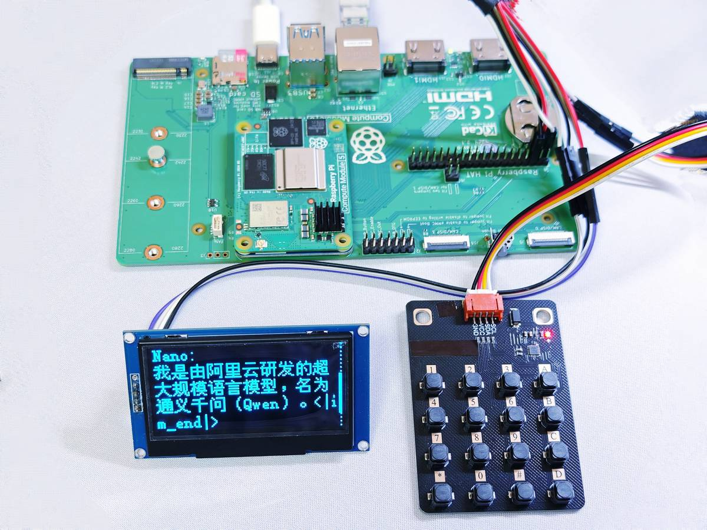
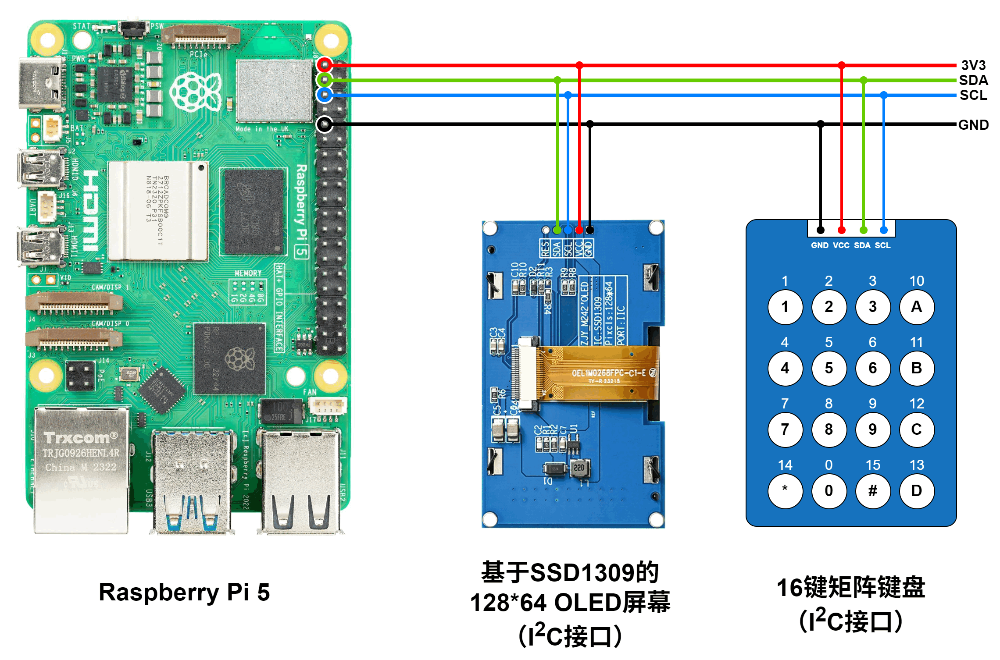
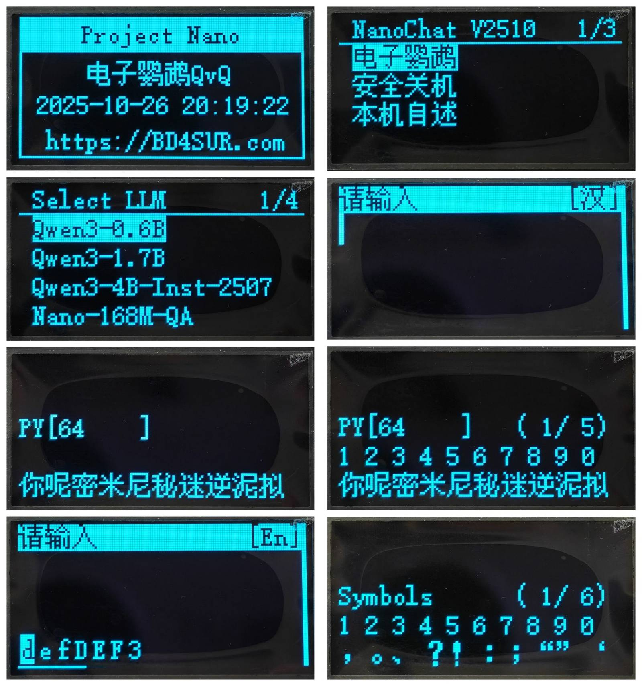

# Qwen3树莓派端侧部署教程



大模型的端侧部署是近期比较热门的技术话题。如今，像树莓派5代这样的嵌入式系统，其算力已经足够推理小规模的语言模型。为了使感兴趣的读者快速体验大模型的端侧推理，本教程介绍了一种比较简单、实用的方案，将Qwen3语言模型部署在树莓派5代上，实现完全离线推理。

本教程尽可能写得简明易懂，读者若按照教程一步步操作，应当不难完成。但是，为了能够顺利部署，希望读者具备一些前置知识，例如访问网络、电子制作、Linux系统等等。

本文介绍的方案，是BD4SUR基于 Andrej Karpathy 的[llama2.c](https://github.com/karpathy/llama2.c)开源项目二次开发的，并增加了键盘输入和OLED屏幕输出功能。特性如下：

- 完全离线的端侧推理，不依赖网络。
- 支持Qwen3-0.6B、Qwen3-1.7B、Qwen3-4B、以及[BD4SUR自主训练的Nano-168M语言模型](https://github.com/bd4sur/Nano)。
- 完全由C语言实现，依赖极少，不依赖于llama.cpp、vLLM等第三方推理引擎，能够运行在树莓派、RK3588甚至路由器等嵌入式Linux系统上。
- 在树莓派5代上，Qwen3-0.6B的推理速度可以达到每秒8~12个词元。
- 通过九键输入法输入中英文文本。
- 暂时不支持多轮对话，只支持单轮对话（历史问答不会被输入到本轮输入的提示词中）。

本方案是BD4SUR的自制大模型项目“电子鹦鹉Nano”的一部分。请访问[项目仓库](https://github.com/bd4sur/Nano)，查看更多的推理场景和演示视频。

> [!NOTE]
> 请注意：该方案只是一个粗糙的原型，一定存在很多缺陷和漏洞。语言模型的输出依赖于输入和采样方式。作者不对该模型所生成的任何内容负责。本系统“按原样”提供，采用MIT协议授权。本系统为作者个人以学习和自用目的所创作的原型作品。作者不对本系统的质量作任何承诺。作者不保证提供有关本系统的任何形式的解释、维护或支持。作者不为任何人使用此系统所造成的任何正面的或负面的后果负责。

## 硬件准备

准备以下材料：

- 树莓派5代：内存4GB或以上，越大越好。建议加装官方主动散热器。
- microSD卡或者SSD：存储树莓派操作系统和语言模型，建议不小于16GB。
- 电源：建议使用树莓派官方5V5A电源，以免输入功率不足导致性能下降。
- OLED屏幕：基于SSD1309芯片的128x64点阵OLED显示屏，I2C接口。
- 矩阵键盘：I2C接口，地址0x27，键码映射如下图。其行为应符合以下说明：上位机通过轮询的方式读取键码，上位机主动发送读取键码指令（0x03），键盘随即返回被按下的键码（无按键的键码为16）。
- 杜邦线等线缆若干。
- 显示器、键盘、鼠标，用于直接在树莓派上操作；或者通过SSH以“无头”方式远程操作。

按照以下图示，连接各个模块：



> [!IMPORTANT]
> 重要提示：切勿带电插拔模块。切勿接反或短路电源线和地线。避免导电物体接触裸露的电子模块，以防意外短路。建议操作前先通过洗手、触摸墙壁等方式释放身上的静电，或者戴防静电手环操作。

## 软件准备

**第1步：环境配置**

首先，按照[树莓派官方文档](https://www.raspberrypi.com/documentation/computers/getting-started.html)的说明，在电脑上下载树莓派系统烧录工具，将 Raspberry Pi OS (64-bit) 烧录进microSD卡。建议使用树莓派官方系统，避免不必要的麻烦。（注：如果想减少模型加载的等待时间，也可以使用NVMe的SSD）

随后，将显示器、键盘、网线连接到树莓派，将烧录了操作系统的microSD卡插入插槽，确保所有模块按照上文说明正确连接，插入电源，树莓派应能自动启动。按照[树莓派官方文档](https://www.raspberrypi.com/documentation/computers/getting-started.html)的说明，完成网络、账户密码等配置（**下文使用的用户名为`pi`**），进入 Raspberry Pi OS。

打开终端，执行`gcc --version`，如果没有报错，则意味着编译工具链已成功安装，进入第二步。否则，执行以下命令，更新并安装必要软件：

```
sudo apt update
sudo apt install git build-essential
```

**第2步：启用并设置I2C、SPI、UART等端口**

通过`sudo raspi-config`进行设置。

打开终端，执行：

```
sudo nano /boot/firmware/config.txt
```

编辑器打开后，在config文件中，将`dtparam=i2c_arm=off`这一行改成以下内容，以启用I2C端口，并将其速率设置为400kHz：

```
dtparam=i2c_arm=on,i2c_arm_baudrate=400000
```

保存并退出，随后执行`sudo reboot`重启树莓派。

重启之后，执行以下命令，检查能否正确识别OLED屏幕和矩阵键盘两个设备。如果找不到`i2cdetect`，尝试使用`/usr/sbin/i2cdetect`。

```
sudo i2cdetect 1 -y
```

如果显示的内容中有27和3c如下，说明树莓派已经识别到了两个I2C设备，其中0x27是矩阵键盘，0x3c是OLED屏幕。

```
     0  1  2  3  4  5  6  7  8  9  a  b  c  d  e  f
00:                         -- -- -- -- -- -- -- --
10: -- -- -- -- -- -- -- -- -- -- -- -- -- -- -- --
20: -- -- -- -- -- -- -- 27 -- -- -- -- -- -- -- --
30: -- -- -- -- -- -- -- -- -- -- -- -- 3c -- -- --
40: -- -- -- -- -- -- -- -- -- -- -- -- -- -- -- --
50: -- -- -- -- -- -- -- -- -- -- -- -- -- -- -- --
60: -- -- -- -- -- -- -- -- -- -- -- -- -- -- -- --
70: -- -- -- -- -- -- -- --
```


**第3步：设置NanoPod服务开机自启**

执行`sudo nano /etc/systemd/system/nano-pod.timer`，增加以下内容：

```
[Unit]
Description=Run Nano-Pod AI Agent Service 2 minutes after boot
Requires=nano-pod.service

[Timer]
OnBootSec=2min
Unit=nano-pod.service

[Install]
WantedBy=timers.target
```

执行`sudo nano /etc/systemd/system/nano-pod.service`，增加以下内容：

```
[Unit]
Description=Nano-Pod AI Agent Service
After=network.target

[Service]
Type=simple
User=bd4sur
WorkingDirectory=/home/bd4sur/ai/Nano/infer/bin
# Environment="OMP_NUM_THREADS=4"
ExecStart=/home/bd4sur/ai/Nano/infer/bin/nano_pod
Restart=on-failure
RestartSec=5

[Install]
WantedBy=multi-user.target
```

执行`sudo systemctl daemon-reload`，并重启服务`sudo systemctl restart nano-pod.service`、`sudo systemctl restart nano-pod.timer`。

**第4步：设置ASR服务开机自启**

设置默认麦克风：

```
sudo nano /etc/asound.conf
添加：defaults.pcm.card 2
其中的2是希望设置为默认capture设备的设备序号（通过 arecord -l 查询）
```

加载FunASR服务容器镜像：

```
sudo docker load -i funasr-online-cpu-0.1.12-20250820.tar
```

然后执行：

```
sudo docker run -p 10096:10095 -d --restart=always --privileged=true --name funasr \
--volume /home/bd4sur/ai/_model/FunASR:/workspace/models \
--workdir /workspace/FunASR/runtime \
funasr-online-cpu-0.1.12-20250820:latest \
/bin/bash -c "/workspace/FunASR/runtime/start_2pass.sh \
--download-model-dir /workspace/models \
--hotword /workspace/models/hotwords.txt \
--certfile 0 > /workspace/models/log.txt 2>&1"
```

**第5步：设置ASR中间件开机自启**

执行`sudo nano /etc/systemd/system/nano-asr.timer`，增加以下内容：

```
[Unit]
Description=Run Nano Agent FunASR WebSocket Client 2 minutes after boot
Requires=nano-asr.service

[Timer]
OnBootSec=2min
Unit=nano-asr.service

[Install]
WantedBy=timers.target
```

执行`sudo nano /etc/systemd/system/nano-asr.service`，增加以下内容：

```
[Unit]
Description=Nano Agent FunASR WebSocket Client
After=network.target

[Service]
Type=simple
User=bd4sur
WorkingDirectory=/home/bd4sur/ai/Nano/infer/asr
ExecStart=/usr/bin/python /home/bd4sur/ai/Nano/infer/asr/asr_client.py --host "0.0.0.0" --port 10096 --mode 2pass --chunk_size "5,10,5" --ssl 0
Restart=always
RestartSec=5

[Install]
WantedBy=multi-user.target
```

**第6步：部署TTS服务，并设置开机自启**

首先安装conda环境：`conda create -n melotts-onnx -y python==3.10`

执行`sudo nano /etc/systemd/system/nano-tts.timer`，增加以下内容：

```
[Unit]
Description=Run MeloTTS ONNX Inference Server after boot
Requires=nano-tts.service

[Timer]
OnBootSec=2min
Unit=nano-tts.service

[Install]
WantedBy=timers.target
```

执行`sudo nano /etc/systemd/system/nano-tts.service`，增加以下内容：

```
[Unit]
Description=MeloTTS ONNX Inference Server
After=network.target

[Service]
Type=simple
User=bd4sur
WorkingDirectory=/home/bd4sur/ai/Nano/infer/tts
ExecStart=/home/bd4sur/miniconda3/bin/conda run -n melotts-onnx python /home/bd4sur/ai/Nano/infer/tts/tts-server-melotts-onnx.py
Restart=always
RestartSec=5

[Install]
WantedBy=multi-user.target
```


**第4步：拉取代码并编译**

首先，拉取代码仓库到本地，并进入代码目录：

```
# 假设当前用户名为pi
cd /home/pi
git clone https://github.com/bd4sur/Nano.git
cd Nano/infer
```

然后，将代码编译为可执行文件：

```
make -j4
```

编译完成后，在`./bin`中会出现一个新的可执行文件`nano_pod`。

在执行程序之前，先从[HuggingFace](https://huggingface.co/bd4sur/Qwen3)或者[ModelScope](https://modelscope.cn/models/bd4sur/qwen3_nano)下载转换好的模型文件，并将其放置于`~/ai/_model/Nano`目录下。所有模型加起来大约将近7GB。

```
# 进入模型目录
cd model

# 从HuggingFace下载
wget -c https://huggingface.co/bd4sur/Qwen3/resolve/main/qwen3-0b6-q80.bin
wget -c https://huggingface.co/bd4sur/Qwen3/resolve/main/qwen3-1b7-q80.bin
wget -c https://huggingface.co/bd4sur/Qwen3/resolve/main/qwen3-4b-instruct-2507-q80.bin
wget -c https://huggingface.co/bd4sur/Nano-168M/resolve/main/nano_168m_625000_sft_947000_q80.bin

# 或者从ModelScope下载
wget -c https://modelscope.cn/models/bd4sur/qwen3_nano/resolve/master/qwen3-0b6-q80.bin
wget -c https://modelscope.cn/models/bd4sur/qwen3_nano/resolve/master/qwen3-1b7-q80.bin
wget -c https://modelscope.cn/models/bd4sur/qwen3_nano/resolve/master/qwen3-4b-instruct-2507-q80.bin
wget -c https://modelscope.cn/models/bd4sur/Nano-168M/resolve/master/nano_168m_625000_sft_947000_q80.bin
```

模型下载完成后，执行刚刚编译得到的`nano_pod`：

```
cd ..
./bin/nano_pod
```

如果一切正常，OLED屏幕亮起，可以开始与电子鹦鹉对话啦。


## 使用方法

本设备采用16键矩阵键盘，键位定义如下：

|1|2|3|4|
|--|--|--|--|
|1<br>英文符号|2<br>ABC|3<br>DEF|A<br>返回/退格|
|4<br>GHI|5<br>JKL|6<br>MNO|B<br>汉英数切换|
|7<br>PQRS|8<br>TUV|9<br>WXYZ|C<br>无功能|
|⁎<br>向上|0<br>符号|#<br>向下|D<br>确认/输入|

**按键说明：**
- **0-9**：数字键，兼作拼音/字母输入
- **A**：返回 / 删除字符 / 停止TTS
- **B**：切换输入法（汉/英/数）
- **C**：Ctrl键（第二功能键）
- **D**：确认 / 提交 / 进入
- **⁎**：向上翻页 / 向左移动 / 光标左移
- **#**：向下翻页 / 向右移动 / 光标右移

**按键方式：**
- **短按**：快速按下后松开
- **长按**：按住超过阈值后松开（可触发连续重复动作）

### 系统主菜单

开机后显示欢迎界面，按任意键进入主菜单：

| 菜单项 | 功能说明 |
|--------|----------|
| 电子鹦鹉 | 进入AI语言模型对话功能 |
| 玲珑天象仪 | 实时星图显示与天文观测 |
| 文字阅读器 | 阅读聊天日志文件 |
| Bad Apple！| 播放Bad Apple动画 |
| 元胞自动机 | 康威生命游戏演示 |
| 设置 | 系统参数配置 |
| 安全关机 | 安全关机确认 |
| 本机自述 | 显示设备信息 |

**菜单操作：**
- **短按 ⁎/#**：上下移动光标
- **短按 D**：进入选中的功能
- **短按 A**：返回上一层

### 电子鹦鹉

#### 选择模型

进入"电子鹦鹉"后，需先选择语言模型：
- 使用 **⁎/#** 上下选择模型
- 按 **D** 确认加载选定模型

#### 文本输入

**输入法切换（按B键）：**
- **[汉]**：拼音输入模式
- **[En]**：字母输入模式  
- **[数]**：数字输入模式

**拼音输入（汉字模式）：**
1. 按 **2-9** 键输入拼音（如"中"=9464）
2. 按 **D** 键进入选字界面
3. 按 **0-9** 选择候选字（0对应第10个）
4. 按 **⁎/#** 翻页查看更多候选字
5. 按 **A** 取消当前拼音输入

**字母输入（英文模式）：**
- 快速连按数字键循环切换字母（如连按2键切换a→b→c→2）
- 屏幕底部显示倒计时进度条
- 倒计时结束后自动确认当前选中的字母

**数字输入：**
- 直接按 **0-9** 输入对应数字

**符号输入：**
- **长按 0** 键进入符号选择界面
- 按 **0-9** 选择符号，**⁎/#** 翻页

**光标移动：**
- **长按 ⁎**：光标向左移动
- **长按 #**：光标向右移动

**其他操作：**
- **长按 A**：删除光标前字符；若缓冲区为空则返回
- **Ctrl+D**：插入换行符
- **Ctrl+1**：切换思考模式（仅Qwen3思考模型）

#### 推理与对话

- **短按 D**：提交输入内容开始AI推理
- **推理中按 A**：中止推理
- **推理完成后按 D**：使用相同输入重新推理
- **长按 D**（需启用ASR）：开始语音输入（PTT）

#### 查看结果

- **⁎/#**：向上/向下滚动查看长文本
- **短按 A**：停止TTS语音朗读
- **短按 A**（无TTS时）：返回输入界面

### 玲珑天象仪

实时显示星图，支持手动控制和IMU体感控制。

#### 基本操作

| 按键 | 普通模式 | Ctrl+按键（第二功能） |
|------|----------|----------------------|
| 1 | 向左偏航（方位角-5°） | 切换投影算法（鱼眼/透视） |
| 2 | 推杆低头（俯仰角-5°） | 切换赤道坐标圈 |
| 3 | 向右偏航（方位角+5°） | 切换地平坐标圈 |
| 4 | 向左坡度（滚转角-5°） | 切换黄道显示 |
| 5 | 开启/关闭IMU / 归中 | 切换天体名称标签 |
| 6 | 向右坡度（滚转角+5°） | 切换姿态指示器 |
| 7 | 拉远视野（焦距-0.1） | 切换大气散射模型 |
| 8 | 拉杆抬头（俯仰角+5°） | 切换地景 |
| 9 | 推近视野（焦距+0.1） | 校准陀螺仪 |
| 0 | 切换到实时模式 | - |
| ⁎ | 时光机向后（过去） | - |
| # | 时光机向前（未来） | - |
| B | 进入玲珑仪设置菜单 | - |
| C | 切换Ctrl状态 | - |
| A | 返回主菜单 | - |

#### 时光机功能

- 按 **⁎** 或 **#** 启动时光机，时间以120秒/步的速度向过去或未来流动
- 反复按可暂停/继续时光机
- 按 **0** 返回实时模式

#### 设置菜单（按B进入）

可配置以下选项：
- 时间和位置
- 陀螺仪开关
- 投影算法（鱼眼/透视）
- 姿态指示器
- 地景（关闭/卫星照片/地面风景）
- 大气散射模型（关闭/简化/一次散射/二次散射）
- 赤道坐标圈
- 地平坐标圈（关闭/方位角/坐标圈）
- 天体名称（关闭/除行星外/仅行星/全部）
- 黄道
- 星芒
- 校准陀螺仪

### 文字阅读器

- 显示聊天记录文件内容
- **⁎/#**：向上/向下滚动
- **短按 A**：停止TTS
- **短按 D**：请求TTS朗读全文（需启用TTS）

### Bad Apple！动画播放

- 自动播放Bad Apple动画
- **短按 A**：返回主菜单

### 元胞自动机（生命游戏）

- 自动运行康威生命游戏
- **短按 A**：返回主菜单
- **短按 D**：重新随机初始化

### 设置菜单

| 设置项 | 说明 |
|--------|------|
| 语言模型生成参数 | 暂未实现 |
| 语音合成(TTS)设置 | 配置TTS模式 |
| 语音识别(ASR)设置 | 配置ASR自动提交 |

### 安全关机

1. 在主菜单选择"安全关机"
2. **长按 D**：确认关机
3. **短按 A**：取消并返回主菜单

### 快捷键汇总

| 场景 | 操作 | 功能 |
|------|------|------|
| 全局 | 短按 A | 返回/取消 |
| 全局 | 短按 D | 确认/进入 |
| 全局 | ⁎/# | 上下翻页/移动 |
| 输入 | 长按 A | 删除字符 |
| 输入 | 短按 B | 切换输入法 |
| 输入 | 短按 C | 切换Ctrl状态 |
| 输入 | 长按 0 | 符号输入 |
| 推理中 | 短按 A | 中止推理 |
| 天象仪 | 按 5 | 切换IMU/归中 |
| 天象仪 | Ctrl+按键 | 高级功能 |

---

程序启动，首先显示主屏幕（图1）。在主屏幕中，按任意键，进入主菜单（图2）。在菜单中，按【*】和【#】键移动光标，按【D】键确认。

选择“电子鹦鹉”选项，进入模型选择菜单（图3），选择所需的模型，待模型加载完毕后（模型加载需要几秒到几十秒的时间，具体因模型的尺寸而异），进入文字输入状态（图4）。




在文字输入状态（图4）下，按【*】和【#】键移动光标，按【A】键删除光标左侧的1个字符，按【B】键切换汉字/英文字母/数字输入状态，按【D】键确认输入。如果输入框内没有内容，则按【A】键会返回主菜单。

汉字输入状态，类似于手机的九键拼音输入法。例如，要输入“你”字，依次按【6】键（mno）和【4】键【ghi】，随着按键输入，屏幕最下方会出现已输入的按键组合所对应的全部候选字（图5）。若拼音输入完毕，按下【D】键，开始选字，此时在候选字列表上方会出现一行数字（图6），直接按下对应的数字键，即可选中并输入相应的数字。数字上方的（1/5）是候选字列表的页码，按【*】和【#】键可以向前向后翻页，查看更多候选字。在拼音输入的任何阶段，按【A】键都会退出拼音输入状态，回到文字输入状态（图4）。

英文字母输入状态，类似于传统的T9英文输入法。例如，要输入字母“d”，则按【2】键（def），屏幕下方会出现这个按键对应的候选字母（图7），同时出现一个倒计时进度条。反复按同一个键，光标向右滚动，直至停留在想要的字母上，停止按键，待倒计时进度掉读完，则选中的字母被输入。【1】键对应的是常用的英文符号，输入方法与普通的字母按键一致。

数字输入状态，按下某个数字键，直接输入对应的数字。

无论在哪种输入状态，长按【0】键，都会呼出符号候选列表。按【*】和【#】键可以向前向后翻页，按数字键，可选中并输入对应的符号。

文字输入完成后，按【D】键确认输入，此时屏幕上显示“Pre-filling...”和进度条，意味着模型推理引擎正在逐词读取输入内容。读取完毕后，进入解码阶段，此时屏幕上开始显示大模型的回答内容，同时自动翻页到最底部。

待大模型回答完毕后，屏幕底部显示本次对话的生成速度。此时，按【*】和【#】键可以向上向下翻页，查看全部回答内容，每按1次滚动1行，滚动到顶部或底部时可自动返回最底部或者最顶部。按【A】键，返回到文字输入状态。按【D】键，可以再次询问刚刚问过的问题。
