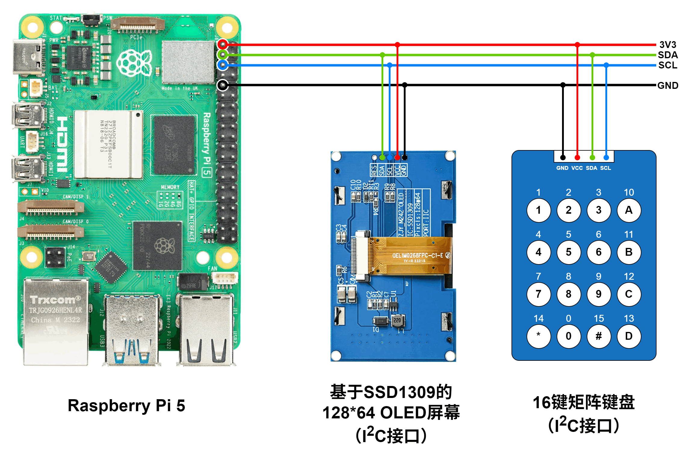

# Qwen3树莓派端侧部署教程


大模型的端侧部署是近期比较热门的技术话题。如今，像树莓派5代这样的嵌入式系统，其算力已经足够推理小规模的语言模型。为了使感兴趣的读者快速体验大模型的端侧推理，本教程介绍了一种比较简单、实用的方案，将Qwen3语言模型部署在树莓派5代上，实现完全离线推理。

本教程尽可能写得简明易懂，读者若按照教程一步步操作，应当不难完成。但是，为了能够顺利部署，希望读者具备一些前置知识，例如访问网络、电子制作、Linux系统等等。

本文介绍的方案，是BD4SUR基于 Andrej Karpathy 的[llama2.c](https://github.com/karpathy/llama2.c)开源项目二次开发的，并增加了键盘输入和OLED屏幕输出功能。特性如下：

- 完全离线的端侧推理，不依赖网络。
- 支持Qwen3-0.6B、Qwen3-1.7B、Qwen3-4B、以及[BD4SUR自主训练的Nano-168M语言模型](https://github.com/bd4sur/Nano)。
- 完全由C语言实现，依赖极少，不依赖于llama.cpp、vLLM等第三方推理引擎，能够运行在树莓派、RK3588甚至路由器等嵌入式Linux系统上。
- 在树莓派5代上，Qwen3-0.6B的推理速度可以达到每秒8~12个词元。
- 通过九键输入法输入中英文文本。
- 暂时不支持多轮对话，只支持单轮对话（历史问答不会被输入到本轮输入的提示词中）。

本方案是BD4SUR的自制大模型项目“电子鹦鹉Nano”的一部分。请访问[项目仓库](https://github.com/bd4sur/Nano)，查看更多的推理场景和演示视频。

> [!NOTE]
> 请注意：该方案只是一个粗糙的原型，一定存在很多缺陷和漏洞。语言模型的输出依赖于输入和采样方式。作者不对该模型所生成的任何内容负责。本系统“按原样”提供，采用MIT协议授权。本系统为作者个人以学习和自用目的所创作的原型作品。作者不对本系统的质量作任何承诺。作者不保证提供有关本系统的任何形式的解释、维护或支持。作者不为任何人使用此系统所造成的任何正面的或负面的后果负责。

## 硬件准备

准备以下材料：

- 树莓派5代：内存4GB或以上，越大越好。建议加装官方主动散热器。
- microSD卡或者SSD：存储树莓派操作系统和语言模型，建议不小于16GB。
- 电源：建议使用树莓派官方5V5A电源，以免输入功率不足导致性能下降。
- OLED屏幕：基于SSD1309芯片的128x64点阵OLED显示屏，I2C接口。
- 矩阵键盘：I2C接口，地址0x27，键码映射如下图。其行为应符合以下说明：上位机通过轮询的方式读取键码，上位机主动发送读取键码指令（0x03），键盘随即返回被按下的键码（无按键的键码为16）。
- 杜邦线等线缆若干。
- 显示器、键盘、鼠标，用于直接在树莓派上操作；或者通过SSH以“无头”方式远程操作。

按照以下图示，连接各个模块：



> [!IMPORTANT]
> 重要提示：切勿带电插拔模块。切勿接反或短路电源线和地线。避免导电物体接触裸露的电子模块，以防意外短路。建议操作前先通过洗手、触摸墙壁等方式释放身上的静电，或者戴防静电手环操作。

## 软件准备

**第一步：环境配置**

首先，按照[树莓派官方文档](https://www.raspberrypi.com/documentation/computers/getting-started.html)的说明，在电脑上下载树莓派系统烧录工具，将 Raspberry Pi OS (64-bit) 烧录进microSD卡。建议使用树莓派官方系统，避免不必要的麻烦。（注：如果想减少模型加载的等待时间，也可以使用NVMe的SSD）

随后，将显示器、键盘、网线连接到树莓派，将烧录了操作系统的microSD卡插入插槽，确保所有模块按照上文说明正确连接，插入电源，树莓派应能自动启动。按照[树莓派官方文档](https://www.raspberrypi.com/documentation/computers/getting-started.html)的说明，完成网络、账户密码等配置（**下文使用的用户名为`pi`**），进入 Raspberry Pi OS。

打开终端，执行`gcc --version`，如果没有报错，则意味着编译工具链已成功安装，进入第二步。否则，执行以下命令，更新并安装必要软件：

```
sudo apt update
sudo apt install git build-essential
```

**第二步：启用并设置I2C端口**

打开终端，执行：

```
sudo nano /boot/firmware/config.txt
```

编辑器打开后，在config文件中，将`dtparam=i2c_arm=off`这一行改成以下内容，以启用I2C端口，并将其速率设置为400kHz：

```
dtparam=i2c_arm=on,i2c_arm_baudrate=400000
```

保存并退出，随后执行`sudo reboot`重启树莓派。

重启之后，执行以下命令，检查能否正确识别OLED屏幕和矩阵键盘两个设备：

```
sudo i2cdetect 1 -y
```

如果显示的内容中有27和3c如下，说明树莓派已经识别到了两个I2C设备，其中0x27是矩阵键盘，0x3c是OLED屏幕。

```
     0  1  2  3  4  5  6  7  8  9  a  b  c  d  e  f
00:                         -- -- -- -- -- -- -- --
10: -- -- -- -- -- -- -- -- -- -- -- -- -- -- -- --
20: -- -- -- -- -- -- -- 27 -- -- -- -- -- -- -- --
30: -- -- -- -- -- -- -- -- -- -- -- -- 3c -- -- --
40: -- -- -- -- -- -- -- -- -- -- -- -- -- -- -- --
50: -- -- -- -- -- -- -- -- -- -- -- -- -- -- -- --
60: -- -- -- -- -- -- -- -- -- -- -- -- -- -- -- --
70: -- -- -- -- -- -- -- --
```

**第三步：拉取代码并编译**

首先，拉取代码仓库到本地，并进入代码目录：

```
cd /home/pi
git clone https://github.com/bd4sur/Nano.git
cd Nano/nanochat
```

然后，将代码编译为可执行文件：

```
cd ..
make -j4
```

编译完成后，在当前目录中会出现一个新的可执行文件`nanochat`。

在执行程序之前，先从[HuggingFace](https://huggingface.co/bd4sur/Qwen3)或者[ModelScope](https://modelscope.cn/models/bd4sur/qwen3_nano)下载转换好的模型文件，并将其放置于`model`目录下。所有模型加起来大约将近7GB。

```
# 进入模型目录
cd model

# 从HuggingFace下载
wget -c https://huggingface.co/bd4sur/Qwen3/resolve/main/qwen3-0b6-q80.bin
wget -c https://huggingface.co/bd4sur/Qwen3/resolve/main/qwen3-1b7-q80.bin
wget -c https://huggingface.co/bd4sur/Qwen3/resolve/main/qwen3-4b-instruct-2507-q80.bin
wget -c https://huggingface.co/bd4sur/Nano-168M/resolve/main/nano_168m_625000_sft_947000_q80.bin

# 或者从ModelScope下载
wget -c https://modelscope.cn/models/bd4sur/qwen3_nano/resolve/master/qwen3-0b6-q80.bin
wget -c https://modelscope.cn/models/bd4sur/qwen3_nano/resolve/master/qwen3-1b7-q80.bin
wget -c https://modelscope.cn/models/bd4sur/qwen3_nano/resolve/master/qwen3-4b-instruct-2507-q80.bin
wget -c https://modelscope.cn/models/bd4sur/Nano-168M/resolve/master/nano_168m_625000_sft_947000_q80.bin
```

模型下载完成后，返回上一级目录，执行刚刚编译得到的`nanochat`：

```
./nanochat
```

如果一切正常，OLED屏幕亮起，可以开始与电子鹦鹉对话啦。


## 使用方法

首先介绍16键矩阵键盘的功能。

|1|2|3|4|
|--|--|--|--|
|1<br>英文符号|2<br>ABC|3<br>DEF|A<br>返回/退格|
|4<br>GHI|5<br>JKL|6<br>MNO|B<br>汉英数切换|
|7<br>PQRS|8<br>TUV|9<br>WXYZ|C<br>无功能|
|*<br>向上|0<br>符号|#<br>向下|D<br>确认/输入|

程序启动，首先显示主屏幕（图1）。在主屏幕中，按任意键，进入主菜单（图2）。在菜单中，按【*】和【#】键移动光标，按【D】键确认。

选择“电子鹦鹉”选项，进入模型选择菜单（图3），选择所需的模型，待模型加载完毕后（模型加载需要几秒到几十秒的时间，具体因模型的尺寸而异），进入文字输入状态（图4）。


在文字输入状态（图4）下，按【*】和【#】键移动光标，按【A】键删除光标左侧的1个字符，按【B】键切换汉字/英文字母/数字输入状态，按【D】键确认输入。如果输入框内没有内容，则按【A】键会返回主菜单。

汉字输入状态，类似于手机的九键拼音输入法。例如，要输入“你”字，依次按【6】键（mno）和【4】键【ghi】，随着按键输入，屏幕最下方会出现已输入的按键组合所对应的全部候选字（图5）。若拼音输入完毕，按下【D】键，开始选字，此时在候选字列表上方会出现一行数字（图6），直接按下对应的数字键，即可选中并输入相应的数字。数字上方的（1/5）是候选字列表的页码，按【*】和【#】键可以向前向后翻页，查看更多候选字。在拼音输入的任何阶段，按【A】键都会退出拼音输入状态，回到文字输入状态（图4）。

英文字母输入状态，类似于传统的T9英文输入法。例如，要输入字母“d”，则按【2】键（def），屏幕下方会出现这个按键对应的候选字母（图7），同时出现一个倒计时进度条。反复按同一个键，光标向右滚动，直至停留在想要的字母上，停止按键，待倒计时进度掉读完，则选中的字母被输入。【1】键对应的是常用的英文符号，输入方法与普通的字母按键一致。

数字输入状态，按下某个数字键，直接输入对应的数字。

无论在哪种输入状态，长按【0】键，都会呼出符号候选列表。按【*】和【#】键可以向前向后翻页，按数字键，可选中并输入对应的符号。

文字输入完成后，按【D】键确认输入，此时屏幕上显示“Pre-filling...”和进度条，意味着模型推理引擎正在逐词读取输入内容。读取完毕后，进入解码阶段，此时屏幕上开始显示大模型的回答内容，同时自动翻页到最底部。

待大模型回答完毕后，屏幕底部显示本次对话的生成速度。此时，按【*】和【#】键可以向上向下翻页，查看全部回答内容，每按1次滚动1行，滚动到顶部或底部时可自动返回最底部或者最顶部。按【A】键，返回到文字输入状态。按【D】键，可以再次询问刚刚问过的问题。
